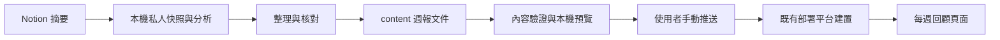

# Showcase 每週回顧與分類趨勢

狀態：第一版已實作於本機，尚未推送或部署到遠端。更新日期：2026-10-09。

## 使用方式

- `/insights`：整體觀察、分類占比、日期篩選與六週回顧。
- `/insights/{週日日期}`：單週分析、分類數量、代表影片與上下週導航。
- 首頁「每週回顧與分類趨勢」連至總覽。
- 本機啟動：`npm --prefix apps/showcase run dev`，預設 port 3000。

[私人完整分析與來源索引](../../data/reports/weekly-insights/2026-09-01/calendar-weeks/overview.md)保存在被 Git 忽略的 `data/reports/`。網站版本使用整理過的主題分析、統計與部分原始影片連結，不載入原始 Notion 正文或私人快照。

## 週期與分析口徑

一週固定為 **週日到週六**，時區為 `Asia/Taipei`。先將 Notion `created_time` 轉成台灣日期，再回推當週週日。URL slug 是週日日期，與分析資料起點分開。

資料從 2026-09-01 開始，因此第一週 8/30–9/5 的 `coverageStart` 是 9/1；這是首週部分資料，不能當成完整七天。最後一週 10/4–10/10 截至 10/9 查詢當下，標示進行中。原先以 9/1 每七天分組的版本已由本週曆規則取代。

每週使用半開區間 `[start, endExclusive)`；9/6 00:00 台灣時間或 UTC 9/5 16:00 都歸 9/6–9/12。`endExclusive` 為下個週日。

|期間（日–六）|原始頁面|週內不同來源|觀察狀態|
|---|---:|---:|---|
|8/30–9/5|43|42|從 9/1 開始；首週部分資料|
|9/6–9/12|48|47|完整週|
|9/13–9/19|88|86|完整週|
|9/20–9/26|108|103|完整週|
|9/27–10/3|116|109|完整週|
|10/4–10/10|68|66|截至 10/9；進行中|

全期共有 471 筆頁面、421 個不同來源。週內去重數合計為 453，包含 32 次跨週重現；同一週的 18 筆重複紀錄已去除。不能把週次來源合計當成全期不同來源數。

- YouTube 以 video ID 辨識來源；其他網址用來源網址，缺網址用 page ID。
- 同週保留最早收錄作統計代表；跨週再次收錄仍算入當週，另列新來源與再次出現數。
- 「新來源」是從本系列 9/1 起第一次出現，不是歷來首次收錄。
- 同一來源只有一個主分類，八類定義與 ID 固定；次要議題不重複計數。
- 占比為分類來源數除以當週來源數，變化用百分點；空週顯示「—」。
- 可比較完整週須同時符合 `periodState=closed`、`dataCompleteness=complete`、`coverageStart=start`。
- 原始 Date、Tags 皆未填寫，不能把 Notion 建立時間寫成影片發布時間或閱讀時間。
- 內容品質不足的摘要不作為推論證據；文章中的產品、醫療、法規與行情敘述未另行查核。

## 頁面行為

公開介面只說明「資料收錄時間」，不顯示後端供應者名稱或特定資料庫欄位。`series.json` 的時間基準採中性 `record-created-time`；公開 API 的 series projection 不包含 `dateBasis`，後端 adapter 與憑證設定留在 server 端。

總覽上方呈現全期來源、原始紀錄與可比較完整週數。分類選單切換長條圖；所有分類的占比表與圖表共用純函式計算。預設圖表只顯示四個完整週，勾選後才加入首週與進行中週，部分週以斜線與文字標示。

日期篩選保留與指定區間重疊的**整週**，不把週報裁切成單日統計。`from`、`to`、`category`、`partial` 保存於 URL query。篩選後數量標示為「週次來源合計」，包含跨週重現；整體觀察仍描述完整系列，畫面另有說明。

占比變化使用篩選後最近兩個可比較完整週，明確列出實際日期。沒有符合週報或沒有完整週時顯示空狀態，提供清除日期操作。

單週頁顯示週曆日期、完整程度、資料截至時間、revision、正文、分類長條與代表來源。第一版僅附原始 YouTube 連結，週報瀏覽不修改文章已讀狀態。不存在的週報回 404。

列表與詳情都有 SSR 標題、描述與 canonical；詳情包含 Markdown 正文，沿用現有 site-url helper 與分享圖片。沒有瀏覽時生成分析的 LLM 呼叫，也不即時查詢 Notion。

## 文件位置與手動更新

```text
data/reports/weekly-insights/2026-09-01/
  snapshot.private.json                # 原始分類資料；私人
  calendar-weeks/
    overview.md                        # 修正後的私人總覽
    2026-08-30.md                       # 第一份週日到週六週報

apps/showcase/content/weekly-insights/
  series.json                          # 分類目錄、週報清單、系列統計
  overview.md                          # 整體觀察的展示正文
  2026-08-30/
    report.json                        # metadata、數量、代表來源
    report.md                          # 可編輯的每週分析

apps/showcase/.generated/weekly-insights.ts # 建置產物；Git 忽略
```



更新步驟：

1. 使用下方週報 skill，先根據進度列出待補週，再讀取 Notion 摘要並核對正文、分類、Taipei 日期與來源鍵。私人資料放 `data/reports/`；進度 CLI 不直接匯出 Notion 或呼叫 LLM，讀取與撰寫由 skill 引導 agent 完成。
2. 在 `content/weekly-insights/{週日日期}/` 編輯 `report.json` 和 `report.md`，更新既有週使用同一目錄並增加 revision。
3. 將該週加到 `series.json` 的 `reportStarts`。新報告先設 `published: false`，確認要展示的內容後才設 true 並填入 publishedAt。
4. 更新系列與各份週報的共同 `asOf`，核對 periodState、coverageStart、分類計數、新來源與跨週重現，必要時更正其他受影響週與 overview。
5. 執行以下檢查並重新啟動開發伺服器，使文件重新打包：

```bash
npm --prefix apps/showcase run insights:check
npm --prefix apps/showcase run test
npm --prefix apps/showcase run build
npm --prefix apps/showcase run test:ssr
npm --prefix apps/showcase run dev
```

6. 使用者檢查 diff 後手動 commit/push。若由 agent 操作遠端 push、發布或部署，依 AGENTS.md 仍須在具體變更可檢查後取得當次確認。
7. 部署後核對頁尾版本、週報 revision 與資料日期。撤稿設為未發布或移出 manifest，重新建置並清理 CDN 快取。

`predev`、`pretest`、`prebuild` 會先驗證內容並生成 registry；一般的 test/build/SSR 指令已保留。registry 被 server 明確 import，隨 Nitro bundle 打包；部署 runtime 不用 `fs` 從 repository 讀檔。content 文件只在重啟／建置時重新載入。

## 可續跑的週報 skill

實作於 [showcase-weekly-insights](../../.agents/skills/showcase-weekly-insights/SKILL.md)，安裝於專案的 `.agents/skills/`，隨 repository 保存，僅供此專案使用，不安裝到全域 skills 目錄。手動呼叫範例：

```text
使用 $showcase-weekly-insights 補跑目前尚未完成的週報。
使用 $showcase-weekly-insights 補到 2026-11-07。
使用 $showcase-weekly-insights 包含本週，更新到今天。
使用 $showcase-weekly-insights 重算 2026-09-06 到 2026-09-19。
```

預設補到台灣時間最近已結束的週六，不固定只看最近一個月，因此隔數週再執行仍會列出所有未完成週。截止日期用於選取整週；指定已結束週內的平日，也包含該週完整日–六。包含本週需要明確指定，保留實際截至日期與 open 狀態。

### 進度與範圍判定

進度檔為 `data/reports/weekly-insights/progress.json`，隨私人資料被 Git 忽略，不放到 website bundle。每週紀錄：

|欄位|用途|
|---|---|
|`status`|closed 或 open；open 不算最終完成，下次仍重跑|
|`asOf`、`recordedAt`|資料查詢截至與 checkpoint 保存時間|
|`revision`、`artifactHash`|已核對的 metadata／正文版本與指紋|
|`policyHash`|系列起點、分類、analysisVersion、分週及去重規則指紋|
|`snapshot`、`snapshotHash`|私人快照位置與指紋，供來源索引與結果核對|

planner 從 collectionStart 所在週日逐週檢查，不使用最大日期作為唯一 cursor。未登記週、較早的缺口、之前的 open 週、分析規則改變、報告改動、快照遺失／改動、移出 manifest 的週都會重新列入待辦。查詢失敗、分頁未完成或文件未通過驗證不保存成功進度；中斷後保留其他成功週，再次 plan 即可補缺口。不存在的進度不能直接推定既有文件成功，先驗證報告及來源快照後 bootstrap。

目前已使用既有私人快照 bootstrap 六週。五份 closed 週涵蓋 9/1–10/3；首週雖非完整比較週，但已完成其可觀察範圍。10/4 週是 open，選擇包含本週或待它結束後執行時必須重查。

只同步全站共同 asOf／publishedAt 不會令 closed 週重新排入待辦，進度保留原始查詢截至時間；實質內容改動仍會觸發重算。Notion 上後續編輯不會在唯讀 plan 階段自動被偵測，使用者要刷新歷史資料時用 `--refresh` 指定範圍。重新抓取後若來源分類或首次出現判斷改變，須重新核對受影響的後續週與整體觀察。

### CLI 與保存時機

從 repository 根目錄執行；`plan` 不讀 Notion、不寫進度、不呼叫 LLM：

```bash
make showcase-insights-plan
python3 .agents/skills/showcase-weekly-insights/scripts/progress.py plan --through 2026-11-07
python3 .agents/skills/showcase-weekly-insights/scripts/progress.py plan --include-open
python3 .agents/skills/showcase-weekly-insights/scripts/progress.py plan \
  --from 2026-09-06 --through 2026-09-19 --refresh
```

第一個命令回傳 JSON 的 `weeks` 待辦、`skipped` 與 `lastContiguousClosedWeek`；後者只是診斷資訊，不能取代逐週判定。CLI 拒絕未來截止日期與未明確選入的本週。

新執行使用 `data/reports/weekly-insights/runs/{執行時間}/snapshot.private.json` 保存不可變快照。讀取範圍須完整分頁、以 created_time 分週；新來源判定沿用從 9/1 起完整來源索引，不只比較本次補跑週。索引不足先補取歷史來源。

每週產出整理文件並完成本機展示核對後登記：

```bash
python3 .agents/skills/showcase-weekly-insights/scripts/progress.py record \
  --week 2026-10-04 \
  --snapshot data/reports/weekly-insights/runs/RUN/snapshot.private.json
make showcase-insights-progress-test
```

`record` 先執行全系列 `insights:check`，並要求該週在 manifest、有完整資料、已設本機展示旗標與可讀的私人快照。原子替換 JSON 成功後才進度生效；open 成果可保存，但仍保持待補。每週成功立即 checkpoint，不等所有待補週結束。多週執行時可先將未完成新週保留為 draft，再逐週核對，避免尚未完成文件阻擋驗證。

`bootstrap --snapshot <既有私人快照>` 可匯入已核對的既有週，保留已登記紀錄；它不負責辨識快照是否真的包含完整來源，agent 必須核對。進度工具不是語意審查器，也不會自動生成分類與分析文字。

寫入採 `.lock` 排除同時更新；中斷留下 lock 時，確認原流程已停止後才移除。每次單一 agent 執行；此 lock 不涵蓋內容編輯。快照被進度引用後不可覆寫。更換電腦時須手動搬移私人進度及快照；只 clone repository 不會帶回執行進度，需重新 bootstrap 或補跑。

skill 完成後回報處理、跳過、失敗與待補週，更新本機展示文件；不自動設定 cron、push 或部署。遠端發佈仍依 AGENTS.md 當次確認規則。

## 實際資料契約

`series.json`：schemaVersion、analysisVersion、collectionStart、asOf、timezone、weekConvention、dateBasis、dedupPolicy、uniqueSourceCount、categories、reportStarts。

`report.json`：schemaVersion、analysisVersion、published、publishedAt、revision、start、endExclusive、coverageStart、asOf、periodState、dataCompleteness、title、summary、metrics、categories、sources、qualityNote。

`metrics` 包含 rawCount、sourceCount、newSourceCount、recurringSourceCount；categories 是固定分類 ID 與 count。sources 是整理過的 title、categoryId、HTTPS YouTube sourceUrl，僅為代表文章。

驗證器要求：

- 週日開始、七天區間、coverageStart 與系列起點相符、期間狀態與 asOf 相符。
- 計數皆為非負整數；分類合計等於 sourceCount；new + recurring = sourceCount ≤ rawCount。
- 日期、schema、分析版本與分類 ID 一致；不得重複 slug、來源 URL 或分類。
- 已發布報告必須有 publishedAt、title、summary 與非空正文；非法網址與 Markdown 的危險 URI 阻止建置。
- 清單外文件不讀取，draft 不進 registry；未知原始欄位不轉交 API。路徑只能是有效日期。
- 私人 Notion 連結不進展示 Markdown；來源卡片只允許 YouTube HTTPS URL。
- 系列所有週皆展示時，新來源合計必須等於 uniqueSourceCount。部分週未發布時隱藏系列整體摘要與全期去重數，避免把未發布內容透過 overview 帶出。

現有 Notion adapter 並未以 Public 控制文章讀取；本次 471 筆 Public 均為 false。新功能以獨立的展示文件／manifest 管理內容，沒有改動原始 Notion 頁面的可見性，也不將私人摘要全文轉成網站資料。

## 模組與驗證

|位置|責任|
|---|---|
|`utils/weekly-insights.ts`|週日分週、完整週選取、占比、區間篩選與顯示格式|
|`types/weekly-insights.ts`|列表與詳情契約|
|`scripts/weekly-insights-content.mjs`|驗證文件、白名單欄位與生成 registry|
|`server/utils/weekly-insights.ts`|讀取已打包 snapshot，列表省略正文與來源|
|`server/api/showcase/insights/`|列表、詳情與 404；公共 cache TTL 300 秒及內容 ETag|
|`pages/insights/`|SSR 總覽與單週詳情|
|`components/InsightCategoryTrend.vue`|分類占比長條圖|
|`components/WeeklyInsightCard.vue`|週報卡片|
|`server/plugins/showcase-error-cache.ts`|週報錯誤回應的快取保護；API 查無週報時由 endpoint 明確回傳 404 與 no-store|
|`.agents/skills/showcase-weekly-insights/`|手動整理流程、逐週進度規劃、成功 checkpoint 與可續跑測試|

自動檢查覆蓋週日界線、跨年、週內與系列統計契約、部分週排除、draft、路徑與 URL、日期篩選、分類切換、空狀態、頁面正文、API cache、SSR metadata 及 404。原有文章列表與分享 SSR 檢查一併執行。

進度工具另有 8 項 unittest，涵蓋週日分週／跨年、預設截止、歷史平日選整週、缺口、open 重跑、刷新、報告／規則／快照變動與原子保存。後續可加入直接匯出 Notion 的 CLI、草稿產生工具、單週比較細節、登入後私人報表。
