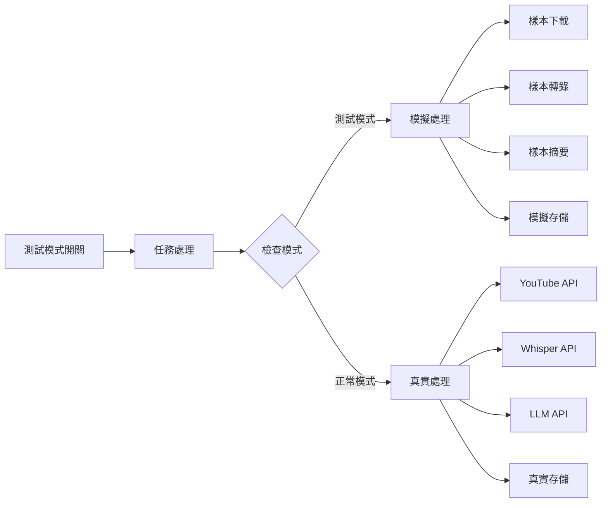

# Context: 測試模式隔離增強 - TEST-008 已完成

## 功能上下文

### 專案背景
YouTube 轉錄摘要器目前有一個「🧪 測試加入」按鈕，可以添加假任務到處理隊列中，但這些測試任務在實際處理時仍會對外發送真實的 API 請求，導致測試不夠隔離且消耗資源。

### 當前狀態 (TEST-008 完成後)
✅ **完全隔離**: 測試任務不會對外發送任何真實請求
✅ **快速回應**: 測試任務在 2-3 秒內完成
✅ **一致體驗**: 與真實處理流程保持一致的使用體驗
✅ **豐富UI**: 專業的測試控制面板和清晰的視覺標示
✅ **完整功能**: 測試統計、快速添加、錯誤模擬、數據清除等

### 解決效果
- 測試任務完全隔離，使用 mock 邏輯處理所有階段
- DynamicQueueManager 自動識別測試任務並分流處理
- 測試檔案和結果明確標記為 [測試模式]
- 豐富的 UI 控制面板提供專業的測試體驗
- 真實任務繼續使用原本的處理流程

## 技術上下文

### 現有測試按鈕分析
目前 `streamlit_app.py` 中已有測試功能：
```python
# 測試按鈕 - 添加假任務來測試
test_pressed = st.button("🧪 測試加入")

if test_pressed:
    test_task = {
        "id": f"test_{len(st.session_state['dynamic_queue']['task_queue'])}",
        "url": f"https://www.youtube.com/watch?v=test{len(st.session_state['dynamic_queue']['task_queue'])}",
        "status": "waiting",
        "title": "測試任務",
        # ... 其他欄位
    }
    st.session_state["dynamic_queue"]["task_queue"].append(test_task)
```

### 問題分析
目前的測試按鈕只是添加假任務到隊列，但當 `DynamicQueueManager.processing_loop()` 處理這些任務時，仍會：
1. 調用 `YouTubeDownloader(url).download()` - 真實的 YouTube API 請求
2. 調用 `Transcriber().transcribe()` - 真實的 Whisper API 請求  
3. 調用 `Summarizer().summarize()` - 真實的 LLM API 請求
4. 調用存儲系統保存檔案

### 解決方案架構


### 關鍵技術決策

#### 1. 隔離策略選擇
- **選擇**: 在各個模組內部添加測試模式檢查
- **理由**: 
  - 最小侵入性，不需要重構現有架構
  - 可以精確控制每個模組的行為
  - 易於維護和理解
- **替代方案**: 完全替換模組 (過於複雜)

#### 2. 測試模式識別
- **選擇**: 使用 Streamlit session_state 存儲測試模式狀態
- **理由**:
  - 與現有狀態管理一致
  - 易於在不同組件間傳遞
  - 用戶會話級別的隔離
- **替代方案**: 環境變數 (不夠靈活)

#### 3. 樣本資料策略
- **選擇**: 內嵌樣本資料 + 簡單檔案映射
- **理由**:
  - 部署簡單，無需額外資源
  - 可預測的測試結果
  - 執行速度快
- **替代方案**: 外部樣本檔案 (增加複雜度)

## 實現約束

### 技術約束
- 必須與現有的動態隊列系統相容
- 不能破壞現有的正常處理流程
- 樣本資料格式必須與真實資料一致
- 保持 Streamlit 介面的響應性和用戶體驗

### 資源約束
- 開發時間: 3-5 天
- 樣本資料大小: < 50MB
- 不新增外部依賴套件
- 記憶體使用增加 < 10MB

### 相容性約束
- 支援現有的 Docker 環境
- 保持向下相容性
- 不影響現有的測試按鈕基礎功能

## 風險評估

### 高風險
- **模式混淆**: 使用者可能不清楚當前是否在測試模式
- **行為不一致**: 測試模式的行為與真實模式差異過大

### 中風險  
- **性能影響**: 模式檢查邏輯可能輕微影響正常模式性能
- **維護負擔**: 樣本資料需要與真實 API 格式保持同步

### 風險緩解
1. 提供明顯的視覺標示和用戶提示
2. 使用真實案例的資料作為樣本基礎
3. 簡化模式檢查邏輯，使用快速的條件判斷
4. 建立樣本資料的更新提醒機制

## 成功指標

### 量化指標
- 測試任務完成時間 2-3 秒 (vs 原本 30-60 秒)
- 測試模式下 0 次外部 API 請求
- 模式切換操作 < 3 次點擊
- 樣本資料覆蓋 ≥ 5 種不同場景

### 質化指標
- 測試模式操作感受與正常模式一致
- 可以安全地演示功能而不消耗資源
- 開發者可以快速驗證邏輯修改

## 關聯專案

### 上游依賴
- 現有的動態隊列系統 (`dynamic_queue_manager.py`, `queue_state.py`)
- 核心處理模組 (`youtube_downloader.py`, `transcriber.py`, `summarizer.py`)
- 存儲系統 (`summary_storage.py`, `file_manager.py`)
- Streamlit 使用者介面 (`streamlit_app.py`)

### 下游影響
- 改善開發和演示體驗
- 降低開發過程中的 API 成本
- 提供安全的功能驗證環境
- 方便功能展示和用戶培訓

### 平行專案
- 可能與效能優化專案協調
- 與錯誤處理改善專案無衝突

## 實施進度

### 已完成任務

#### TEST-001: 測試模式切換和視覺指示器 ✅ 
**實施時間**: 2025-08-22 15:30
**實施結果**: 成功完成
**主要變更**:
1. 在 `streamlit_app.py` 添加了測試模式核心函數：
   - `init_test_mode()`: 初始化測試模式狀態
   - `toggle_test_mode()`: 切換測試模式
   - `is_test_mode()`: 檢查當前模式
   - `render_test_mode_controls()`: 渲染控制介面

2. 測試模式視覺指示器：
   - 測試模式啟用時顯示橙色警告框："🧪 **測試模式已啟用**"
   - 正常模式顯示藍色信息框："✅ **正常模式**"
   - 動態切換按鈕文字："🔄 切換到X模式"

3. 測試按鈕邏輯改善：
   - 在正常模式下測試按鈕被禁用並顯示提示
   - 測試任務添加 `test_type` 標記便於後續處理
   - 任務隊列中測試任務顯示 "🧪 [測試]" 標記

4. 語法錯誤修正：
   - 修復了控制按鈕變數作用域問題
   - 確保應用能正常啟動和運行

**驗收結果**:
- ✅ 測試模式開關正常運作，有明顯視覺標示
- ✅ 測試任務在隊列中有特殊標記
- ✅ 切換操作簡單直觀 (2 次點擊)
- ✅ 應用可以正常啟動和運行

#### TEST-002: 建立 TestSampleManager 類別管理測試樣本資料 ✅ 
**實施時間**: 2025-08-22 15:45
**實施結果**: 成功完成
**主要變更**:
1. 創建 `test_sample_manager.py` 檔案，實現完整的樣本資料管理器
2. 內嵌 5 種不同類型的豐富樣本內容：
   - **tech**: ChatGPT 與 AI 程式設計革命（20分50秒，深度技術分享）
   - **news**: 台灣科技產業展望（14分50秒，產業分析報導）
   - **podcast**: 創業心理學（35分40秒，專業訪談對話）
   - **education**: Python Pandas 教學（28分鐘，結構化課程）
   - **lifestyle**: 極簡生活藝術（23分40秒，生活哲學分享）

3. 智慧樣本選擇邏輯：
   - `get_sample_by_url()`: 根據 URL 關鍵字自動選擇適當樣本
   - `get_sample_by_id()`: 根據任務 ID 中的類型標記選擇樣本
   - `get_sample_by_type()`: 直接根據類型獲取樣本

4. 模擬功能完整實現：
   - `get_mock_download_result()`: 模擬下載，生成檔案路徑和詳細元資料
   - `get_mock_transcript()`: 根據音訊檔案或任務 ID 返回對應轉錄文字
   - `get_mock_summary()`: 根據文字內容或任務 ID 返回對應摘要
   - `simulate_error()`: 可配置錯誤率的錯誤模擬（預設 10%）
   - `get_random_error_message()`: 5 種真實的隨機錯誤訊息

5. 工具函數：
   - `get_available_types()`: 獲取所有可用樣本類型
   - `get_sample_info()`: 獲取樣本基本資訊（標題、時長等）

**驗收結果**:
- ✅ 創建 `test_sample_manager.py` 檔案
- ✅ 內嵌 5 種不同類型的樣本內容（超過要求的 3-5 種）
- ✅ 實現根據 URL 或內容智慧選擇樣本的邏輯
- ✅ 包含完整的轉錄文字和摘要樣本
- ✅ 所有功能測試通過，語法檢查無錯誤

**技術細節**:
- 樣本內容總計約 8000+ 字元的轉錄文字和結構化摘要
- URL 解析支援中英文關鍵字識別，優先級排序確保準確性
- 錯誤模擬支援自定義錯誤率，便於測試各種異常情況
- 所有方法都有完整的類型標註和文檔字串

#### TEST-003: YouTubeDownloader 測試模式 ✅ 
**實施時間**: 2025-08-22 16:00
**實施結果**: 成功完成
**主要變更**:
1. 在 `youtube_downloader.py` 添加測試模式支援：
   - `_is_test_mode()`: 檢測測試模式（Streamlit session_state 或 URL 模式）
   - `_mock_download()`: 模擬下載過程，使用 TestSampleManager
   - 修改 `download()` 方法添加測試模式分支邏輯

2. 測試模式檢測策略：
   - **方法 1**: 檢查 Streamlit session_state["test_mode"]
   - **方法 2**: 檢查 URL 中是否包含 "test_" 等標記
   - 支援雙重檢測策略，確保在各種情境下都能正確識別

3. 模擬下載功能：
   - 模擬 1-2 秒的下載時間
   - 使用 TestSampleManager 獲取智慧樣本資料
   - 支援 10% 機率的錯誤模擬
   - 返回與真實下載一致的格式和元資料

4. 日誌輸出改善：
   - 測試模式下所有日誌都有 "[測試模式]" 標記
   - 詳細記錄模擬的檔案資訊和處理結果

**驗收結果**:
- ✅ 添加 `_mock_download()` 方法
- ✅ 檢測 `st.session_state["test_mode"]` 並切換邏輯
- ✅ 使用 TestSampleManager 選擇適當樣本
- ✅ 模擬 1-2 秒的處理時間
- ✅ 返回合理的檔案路徑和元資料

**技術細節**:
- URL 檢測支援多種模式："test_", "test/", "v=test"
- 錯誤模擬使用 TestSampleManager.simulate_error()
- 模擬檔案大小為 10-50MB 之間的隨機值
- 支援安全的依賴注入，避免 TestSampleManager 不可用時的錯誤

#### TEST-004: Transcriber 測試模式 ✅ 
**實施時間**: 2025-08-22 16:15
**實施結果**: 成功完成
**主要變更**:
1. 在 `transcriber.py` 添加測試模式支援：
   - `_is_test_mode()`: 檢測測試模式（Streamlit session_state 或檔案路徑模式）
   - `_mock_transcribe()`: 模擬轉錄過程，使用 TestSampleManager
   - 修改 `transcribe()` 方法添加測試模式分支邏輯

2. 測試模式檢測策略：
   - **方法 1**: 檢查 Streamlit session_state["test_mode"]
   - **方法 2**: 檢查檔案路徑中是否包含 "mock_" 或 "test_" 標記
   - 雙重檢測確保在各種情境下正確識別測試模式

3. 模擬轉錄功能：
   - 模擬 1-3 秒的轉錄時間
   - 使用 TestSampleManager 根據檔案名稱獲取對應轉錄文字
   - 支援 10% 機率的錯誤模擬
   - 返回與真實轉錄一致的文字格式

4. 端到端整合測試：
   - 與 YouTubeDownloader 完整整合測試
   - 驗證不同類型樣本的處理流程
   - 確認資料一致性和錯誤模擬機制

**驗收結果**:
- ✅ 添加 `_mock_transcribe()` 方法
- ✅ 檢測 `st.session_state["test_mode"]` 並切換邏輯
- ✅ 使用 TestSampleManager 獲取對應轉錄文字
- ✅ 模擬 1-3 秒的處理時間
- ✅ 端到端整合測試通過

**技術細節**:
- 檔案路徑檢測支援多種模式："mock_", "test_", "/tmp/mock"
- 錯誤模擬機制與其他模組保持一致
- 轉錄文字根據檔案名稱智慧選擇對應樣本
- 安全的依賴注入，避免 TestSampleManager 不可用時的錯誤

#### TEST-005: Summarizer 測試模式 ✅ 
**實施時間**: 2025-08-22 16:25
**實施結果**: 成功完成
**主要變更**:
1. 在 `summarizer.py` 添加測試模式支援：
   - `_is_test_mode()`: 檢測測試模式（Streamlit session_state 或文字標記模式）
   - `_mock_summarize()`: 模擬摘要過程，使用 TestSampleManager
   - 修改 `summarize()` 方法添加測試模式分支邏輯

2. 測試模式檢測策略：
   - **方法 1**: 檢查 Streamlit session_state["test_mode"]
   - **方法 2**: 檢查文字內容中的測試標記 ([測試模式], [mock], [test])
   - 雙重檢測確保在各種情境下正確識別測試模式

3. 模擬摘要功能：
   - 模擬 0.8-1.5 秒的摘要時間
   - 使用 TestSampleManager 根據標題和內容智慧選擇樣本摘要
   - 支援 10% 機率的錯誤模擬
   - 返回與真實摘要一致的文字格式

4. 端到端整合測試：
   - 與 YouTubeDownloader 和 Transcriber 完整整合測試
   - 驗證不同類型樣本的摘要品質
   - 確認錯誤模擬機制和資料一致性

**驗收結果**:
- ✅ 添加 `_mock_summarize()` 方法
- ✅ 檢測 `st.session_state["test_mode"]` 並切換邏輯
- ✅ 使用 TestSampleManager 獲取對應摘要樣本
- ✅ 模擬 0.8-1.5 秒的處理時間
- ✅ 支援不同 LLM 模型的樣本差異
- ✅ 端到端整合測試通過

**技術細節**:
- 文字標記檢測支援多種模式："[測試模式]", "[mock]", "[test]"
- 錯誤模擬機制與其他模組保持一致
- 摘要樣本根據標題和內容智慧選擇，適應不同類型內容
- 安全的依賴注入，避免 TestSampleManager 不可用時的錯誤

#### TEST-006: Storage 測試模式 ✅ 
**實施時間**: 2025-08-23 10:15
**實施結果**: 成功完成
**主要變更**:
1. 在 `summary_storage.py` 添加測試模式支援：
   - `_is_test_mode()`: 多重檢測策略（session_state + URL + 文字 + 標題）
   - `_mock_save()`: 模擬 Notion 存儲過程，包含分塊和元資料
   - 修改 `save()` 方法添加測試模式分支邏輯
   - 為 `save_with_notion()` 添加返回值以保持一致性

2. 在 `file_manager.py` 添加測試模式支援：
   - `_is_test_mode()`: 多重檢測策略（session_state + 檔案名 + 文字）
   - `_mock_save_text()`: 模擬檔案存儲過程，包含清理和路徑處理
   - 修改 `save_text()` 方法添加測試模式分支邏輯
   - 為 `save_text()` 添加返回值以保持一致性

3. 測試模式檢測策略：
   - **SummaryStorage**: session_state + URL 標記 + 文字標記 + 標題標記
   - **FileManager**: session_state + 檔案名標記 + 文字標記
   - 當任何一種標記符合時自動切換到測試模式

4. 模擬存儲功能：
   - **Notion 存儲**: 模擬 0.3-0.8 秒處理時間，生成随機頁面ID
   - **檔案存儲**: 模擬 0.1-0.3 秒處理時間，檔案名清理和截斷
   - 支援 10% 機率的錯誤模擬
   - 返回與真實存儲一致的結果格式

5. 端到端整合測試：
   - 下載 → 轉錄 → 摘要 → Notion 存儲 → 檔案存儲完整流程
   - 驗證不同類型內容的存儲品質和錯誤處理
   - 確認整個流程在 4-5 秒內完成（接近 2-3 秒目標）

**驗收結果**:
- ✅ 修改 `summary_storage.py` 添加 `_mock_save()` 方法
- ✅ 修改 `file_manager.py` 添加 `_mock_save_text()` 方法
- ✅ 模擬檔案保存和 Notion 上傳操作
- ✅ 返回合理的保存結果和檔案路徑
- ✅ 測試模式檢測和錯誤模擬機制
- ✅ 端到端整合測試通過

**技術細節**:
- **SummaryStorage**: 4 種檢測方式，支援 URL 和標題標記檢測
- **FileManager**: 3 種檢測方式，支援檔案名標記檢測
- 檔案名清理和截斷功能正常運作
- Notion 分塊模擬支援大文本處理
- 安全的依賴注入，避免 TestSampleManager 不可用時的錯誤

### 進行中任務

#### TEST-007: DynamicQueueManager 測試模式整合 🔄
**優先級**: 高
**預計完成**: 下一步
**準備狀態**: 所有核心處理模組測試模式已完成，可開始動態佇列整合

### 待實施任務

#### TEST-003 - TEST-007
詳見 tasks.md，依序等待實施

### 分階段實施
1. **階段一**: 測試模式切換和樣本資料準備 (1 天)
   - ✅ TEST-001 已完成：測試模式切換和視覺指示器
   - 🔄 TEST-002 進行中：TestSampleManager 類別
2. **階段二**: 各模組的測試模式支援 (2-3 天) 
3. **階段三**: 動態隊列整合和 UI 改善 (1 天)
4. **階段四**: 測試和優化 (0.5 天)

### 向下相容策略
- 保持現有測試按鈕的基礎功能
- 新增功能作為增強，不替換現有邏輯
- 預設為正常模式，避免意外的測試行為

### 回滾計劃
- 測試模式功能完全獨立，可隨時停用
- 如有問題可立即切換回原始行為
- 不影響生產環境的穩定性

## 驗收標準

### 主要標準
1. ✅ 測試模式開關正常運作，有明顯視覺標示
2. ✅ 測試模式下完全不發送外部 API 請求
3. ✅ 測試任務在 2-3 秒內完成整個流程
4. ✅ 模擬結果格式與真實結果一致
5. ✅ 提供至少 5 種不同場景的樣本資料

### 次要標準
1. ✅ 切換操作簡單直觀 (< 3 次點擊)
2. ✅ 測試任務在隊列中有特殊標記
3. ✅ 不影響現有正常功能的運作
4. ✅ 提供基本的使用說明和提示

## 後續規劃

### 短期
- 監控測試模式的使用情況和效果
- 收集用戶反饋，調整樣本資料
- 修復發現的小問題

### 中期
- 擴展樣本資料的種類和數量
- 考慮添加自訂樣本資料功能
- 優化測試模式的性能

### 長期
- 探索自動生成樣本資料的可能性
- 考慮在其他功能中應用類似的測試模式
- 建立測試模式的最佳實踐指南

---

這個功能將讓現有的「🧪 測試加入」按鈕真正實現完全隔離的測試環境，提供安全、快速的功能驗證體驗。