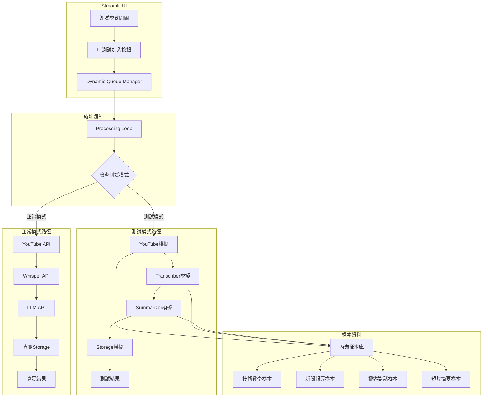
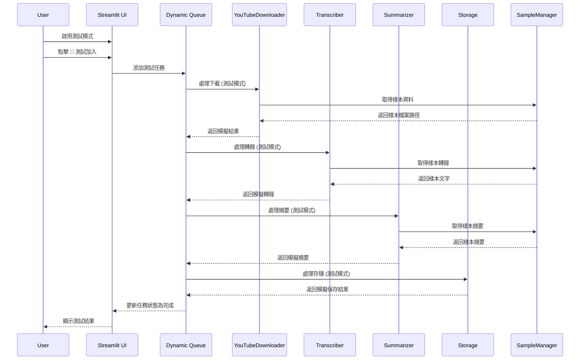
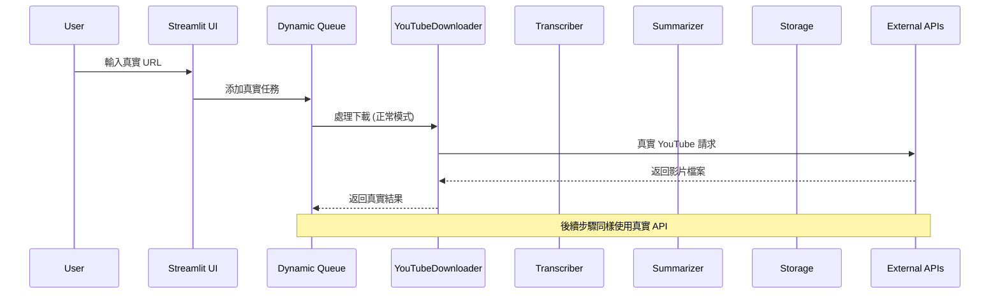

# Design: 測試模式隔離增強

## 設計文件

### 設計概覽

本功能將改善現有的「🧪 測試加入」按鈕，讓測試任務完全隔離，不對外發送任何真實 API 請求。透過在各個模組內部添加測試模式檢查，提供快速、安全的測試環境。

### 設計目標

1. **完全隔離**: 測試模式下零外部 API 請求
2. **快速回饋**: 測試任務 2-3 秒內完成
3. **一致體驗**: 測試流程與真實流程保持一致
4. **簡單易用**: 一鍵切換，操作直觀

### 系統架構



### 核心組件設計

#### 1. 測試模式狀態管理

```python
# 在 streamlit_app.py 中
def init_test_mode():
    """初始化測試模式狀態"""
    if "test_mode" not in st.session_state:
        st.session_state["test_mode"] = False

def toggle_test_mode():
    """切換測試模式"""
    st.session_state["test_mode"] = not st.session_state.get("test_mode", False)

def is_test_mode():
    """檢查是否為測試模式"""
    return st.session_state.get("test_mode", False)

# UI 元件
col1, col2 = st.columns([3, 1])
with col1:
    if st.session_state.get("test_mode", False):
        st.warning("🧪 目前為測試模式 - 不會發送真實請求")
    else:
        st.info("✅ 目前為正常模式")
        
with col2:
    if st.button("🔄 切換模式"):
        toggle_test_mode()
        st.rerun()
```

#### 2. 樣本資料管理器

```python
# test_sample_manager.py
class TestSampleManager:
    """測試樣本資料管理器"""
    
    SAMPLES = {
        "tech_tutorial": {
            "title": "Python 程式設計入門教學",
            "transcript": """今天我們要學習 Python 程式設計的基礎知識。
Python 是一種簡單易學的程式語言，適合初學者入門。
首先我們來看看如何安裝 Python 環境...""",
            "summary": """# Python 程式設計入門教學摘要

## 主要內容
1. **Python 簡介**: 簡單易學的程式語言
2. **環境安裝**: 如何安裝 Python 開發環境  
3. **基礎語法**: 變數、函數、控制結構
4. **實作練習**: 簡單的程式範例

## 適合對象
- 程式設計初學者
- 想要學習 Python 的開發者

## 學習重點
- 掌握 Python 基本語法
- 了解程式設計思維
- 能夠編寫簡單程式""",
            "duration": 1800  # 30 分鐘
        },
        
        "news_report": {
            "title": "科技新聞：AI 技術最新發展",
            "transcript": """最新的人工智慧技術發展報告顯示，
機器學習和深度學習技術在各個領域都有重大突破。
特別是在自然語言處理方面...""",
            "summary": """# AI 技術發展新聞摘要

## 重點消息
1. **技術突破**: 機器學習和深度學習重大進展
2. **應用領域**: 自然語言處理、計算機視覺、自動駕駛
3. **市場影響**: 多個科技公司股價上漲
4. **未來展望**: 預期持續快速發展

## 關鍵數據
- AI 市場規模預計年增長 25%
- 新技術專利申請增加 40%
- 投資金額達到歷史新高""",
            "duration": 900  # 15 分鐘
        },
        
        "podcast_discussion": {
            "title": "創業心得分享播客",
            "transcript": """主持人：今天我們邀請到了成功創業家張先生。
張先生：很高興能夠分享我的創業經驗。
主持人：請問您當初是如何決定創業的呢？
張先生：其實最初是因為看到了市場的需求缺口...""",
            "summary": """# 創業心得分享播客摘要

## 來賓介紹
- **張先生**: 成功創業家，多次創業經驗

## 討論要點
1. **創業動機**: 發現市場需求缺口
2. **創業準備**: 資金、團隊、技術準備
3. **挑戰克服**: 初期困難和解決方案
4. **成功關鍵**: 堅持、學習、適應變化

## 創業建議
- 深入了解目標市場
- 建立優秀的團隊
- 保持學習和適應能力
- 準備面對失敗的心態""",
            "duration": 2700  # 45 分鐘
        }
    }
    
    @classmethod
    def get_sample_by_url(cls, url: str):
        """根據 URL 選擇樣本"""
        if "tech" in url.lower():
            return cls.SAMPLES["tech_tutorial"]
        elif "news" in url.lower():
            return cls.SAMPLES["news_report"]
        elif "podcast" in url.lower() or "talk" in url.lower():
            return cls.SAMPLES["podcast_discussion"]
        else:
            # 預設返回技術教學樣本
            return cls.SAMPLES["tech_tutorial"]
    
    @classmethod
    def get_random_sample(cls):
        """隨機選擇樣本"""
        import random
        return random.choice(list(cls.SAMPLES.values()))
```

#### 3. 模組測試模式集成

##### YouTubeDownloader 測試模式
```python
# youtube_downloader.py 修改
import streamlit as st
from test_sample_manager import TestSampleManager
import time
import os

class YouTubeDownloader:
    def __init__(self, url):
        self.url = url
    
    def download(self):
        # 檢查是否為測試模式
        if hasattr(st, 'session_state') and st.session_state.get("test_mode", False):
            return self._mock_download()
        else:
            return self._real_download()
    
    def _mock_download(self):
        """模擬下載過程"""
        # 模擬處理時間
        time.sleep(1)
        
        # 選擇樣本資料
        sample = TestSampleManager.get_sample_by_url(self.url)
        
        # 模擬檔案路徑
        mock_file_path = f"data/videos/test_{sample['title'][:20]}.mp4"
        
        # 確保目錄存在
        os.makedirs(os.path.dirname(mock_file_path), exist_ok=True)
        
        return {
            "path": mock_file_path,
            "title": sample["title"],
            "duration": sample["duration"],
            "format": "mp4",
            "size": "25.6MB",  # 模擬檔案大小
            "url": self.url
        }
    
    def _real_download(self):
        """真實下載邏輯 (現有程式碼)"""
        # ... 現有的下載邏輯
        pass
```

##### Transcriber 測試模式
```python
# transcriber.py 修改
import streamlit as st
from test_sample_manager import TestSampleManager
import time

class Transcriber:
    def __init__(self, model_size="tiny"):
        self.model_size = model_size
    
    def transcribe(self, audio_file):
        # 檢查是否為測試模式
        if hasattr(st, 'session_state') and st.session_state.get("test_mode", False):
            return self._mock_transcribe(audio_file)
        else:
            return self._real_transcribe(audio_file)
    
    def _mock_transcribe(self, audio_file):
        """模擬轉錄過程"""
        # 模擬處理時間
        time.sleep(1)
        
        # 從檔案名稱推斷使用哪個樣本
        if "tech" in audio_file.lower():
            sample = TestSampleManager.SAMPLES["tech_tutorial"]
        elif "news" in audio_file.lower():
            sample = TestSampleManager.SAMPLES["news_report"]
        elif "podcast" in audio_file.lower():
            sample = TestSampleManager.SAMPLES["podcast_discussion"]
        else:
            sample = TestSampleManager.get_random_sample()
        
        return sample["transcript"]
    
    def _real_transcribe(self, audio_file):
        """真實轉錄邏輯 (現有程式碼)"""
        # ... 現有的轉錄邏輯
        pass
```

##### Summarizer 測試模式
```python
# summarizer.py 修改
import streamlit as st
from test_sample_manager import TestSampleManager
import time
import hashlib

class Summarizer:
    def __init__(self, model="gemini"):
        self.model = model
    
    def summarize(self, title, text):
        # 檢查是否為測試模式
        if hasattr(st, 'session_state') and st.session_state.get("test_mode", False):
            return self._mock_summarize(title, text)
        else:
            return self._real_summarize(title, text)
    
    def _mock_summarize(self, title, text):
        """模擬摘要過程"""
        # 模擬處理時間
        time.sleep(1)
        
        # 根據輸入文字的特徵選擇樣本
        text_hash = hashlib.md5(text.encode()).hexdigest()
        
        # 根據文字內容關鍵字選擇樣本
        if "python" in text.lower() or "程式" in text:
            sample = TestSampleManager.SAMPLES["tech_tutorial"]
        elif "新聞" in text or "報告" in text:
            sample = TestSampleManager.SAMPLES["news_report"]
        elif "創業" in text or "分享" in text:
            sample = TestSampleManager.SAMPLES["podcast_discussion"]
        else:
            sample = TestSampleManager.get_random_sample()
        
        return sample["summary"]
    
    def _real_summarize(self, title, text):
        """真實摘要邏輯 (現有程式碼)"""
        # ... 現有的摘要邏輯
        pass
```

#### 4. Storage 測試模式

```python
# summary_storage.py 修改
import streamlit as st

class SummaryStorage:
    def save(self, title, text, model, url):
        # 檢查是否為測試模式
        if hasattr(st, 'session_state') and st.session_state.get("test_mode", False):
            return self._mock_save(title, text, model, url)
        else:
            return self._real_save(title, text, model, url)
    
    def _mock_save(self, title, text, model, url):
        """模擬保存過程"""
        # 模擬處理時間
        time.sleep(0.5)
        
        # 返回模擬的保存結果
        mock_file_path = f"data/_summarized/test_{title[:20]}.md"
        
        return {
            "success": True,
            "file_path": mock_file_path,
            "notion_url": "https://notion.so/test-page-12345",
            "message": "測試模式：模擬保存成功"
        }
    
    def _real_save(self, title, text, model, url):
        """真實保存邏輯 (現有程式碼)"""
        # ... 現有的保存邏輯
        pass

# file_manager.py 修改
class FileManager:
    @staticmethod
    def save_text(text, output_file):
        # 檢查是否為測試模式
        if hasattr(st, 'session_state') and st.session_state.get("test_mode", False):
            return FileManager._mock_save_text(text, output_file)
        else:
            return FileManager._real_save_text(text, output_file)
    
    @staticmethod
    def _mock_save_text(text, output_file):
        """模擬檔案保存"""
        # 不實際寫入檔案，只返回成功訊息
        return {
            "success": True,
            "file_path": output_file,
            "message": "測試模式：模擬檔案保存成功"
        }
    
    @staticmethod
    def _real_save_text(text, output_file):
        """真實檔案保存 (現有程式碼)"""
        # ... 現有的檔案保存邏輯
        pass
```

#### 5. UI 增強設計

```python
# streamlit_app.py 中的測試模式 UI
def render_test_mode_controls():
    """渲染測試模式控制項"""
    
    # 初始化測試模式狀態
    if "test_mode" not in st.session_state:
        st.session_state["test_mode"] = False
    
    # 測試模式狀態顯示
    col1, col2, col3 = st.columns([4, 2, 2])
    
    with col1:
        if st.session_state["test_mode"]:
            st.warning("🧪 **測試模式已啟用** - 所有操作都是模擬的，不會產生真實的外部請求")
        else:
            st.info("✅ **正常模式** - 將使用真實的 API 服務")
    
    with col2:
        mode_text = "切換到正常模式" if st.session_state["test_mode"] else "切換到測試模式"
        if st.button(f"🔄 {mode_text}"):
            st.session_state["test_mode"] = not st.session_state["test_mode"]
            st.rerun()
    
    with col3:
        if st.session_state["test_mode"]:
            st.button("🧪 測試加入", help="在測試模式下添加模擬任務")
        else:
            st.button("🧪 測試加入", help="切換到測試模式以使用此功能", disabled=True)

def render_task_queue_with_test_indicators():
    """渲染帶有測試標示的任務隊列"""
    
    with st.expander("📋 任務隊列", expanded=True):
        dq = get_queue_state()
        
        if not dq["task_queue"]:
            st.write("目前沒有任務。")
        else:
            for idx, task in enumerate(dq["task_queue"]):
                # 檢查是否為測試任務
                is_test_task = task.get("id", "").startswith("test_")
                
                status = task["status"]
                prefix = ""
                if status == "waiting":
                    prefix = "🟡"
                elif status == "processing":
                    prefix = "🟢"
                elif status == "completed":
                    prefix = "✅"
                elif status == "failed":
                    prefix = "❌"
                
                # 為測試任務添加特殊標記
                test_indicator = " [測試]" if is_test_task else ""
                
                label = f"{prefix} [{status}] {task['url']}{test_indicator}"
                
                # 測試任務使用不同的背景色
                if is_test_task:
                    st.markdown("---")
                    st.markdown(f"🧪 **測試任務**: {label}")
                else:
                    with st.expander(label, expanded=(status=="processing")):
                        st.write(f"任務 ID: {task['id']}")
                        # ... 其他任務詳情
```

### 檔案結構

本功能將創建或修改以下檔案：

```
/usr/src/app/
├── test_sample_manager.py          # 新增：樣本資料管理器
├── youtube_downloader.py           # 修改：添加測試模式支援
├── transcriber.py                  # 修改：添加測試模式支援
├── summarizer.py                   # 修改：添加測試模式支援
├── summary_storage.py              # 修改：添加測試模式支援
├── file_manager.py                 # 修改：添加測試模式支援
├── streamlit_app.py                # 修改：添加測試模式 UI
└── dynamic_queue_manager.py        # 修改：支援測試任務處理
```

### 資料流設計

#### 測試模式流程


#### 正常模式流程 (不變)


### 整合策略

#### 1. 現有程式碼整合
使用最小侵入性的方式，在現有模組中添加測試模式檢查：

```python
# 在每個模組的主要方法中添加
def main_method(self, *args, **kwargs):
    # 檢查測試模式
    if hasattr(st, 'session_state') and st.session_state.get("test_mode", False):
        return self._mock_method(*args, **kwargs)
    else:
        return self._real_method(*args, **kwargs)
```

#### 2. 動態隊列管理器整合
```python
# dynamic_queue_manager.py 修改
class DynamicQueueManager:
    @staticmethod
    def processing_loop():
        """處理隊列中的任務"""
        dq = get_queue_state()
        
        for task in dq["task_queue"]:
            if task["status"] == "waiting":
                # 檢查是否為測試任務
                is_test_task = task.get("id", "").startswith("test_")
                
                if is_test_task:
                    # 確保測試模式已啟用
                    st.session_state["test_mode"] = True
                
                # 處理任務 (各模組會自動檢查測試模式)
                DynamicQueueManager._process_single_task(task)
                
                # 處理完測試任務後可以選擇是否關閉測試模式
                # st.session_state["test_mode"] = False  # 可選
```

#### 3. UI 狀態同步
```python
# 確保 UI 狀態與任務處理同步
def sync_test_mode_with_tasks():
    """同步測試模式與任務狀態"""
    dq = get_queue_state()
    
    # 如果隊列中有測試任務正在處理，自動啟用測試模式
    has_active_test_tasks = any(
        task.get("id", "").startswith("test_") and task["status"] == "processing"
        for task in dq["task_queue"]
    )
    
    if has_active_test_tasks:
        st.session_state["test_mode"] = True
```

### 效能考量

#### 1. 最小化性能影響
- 測試模式檢查使用簡單的條件判斷，性能影響極小
- 樣本資料內嵌在程式碼中，無需檔案 I/O
- 模擬的處理時間保持在合理範圍 (1-2 秒)

#### 2. 記憶體使用
- 樣本資料預計 < 50KB (純文字)
- 不會在正常模式下載入樣本資料
- 使用懶載入策略

### 安全考量

#### 1. 測試模式隔離
- 測試模式下完全不會發送外部請求
- 模擬的檔案操作不會實際寫入檔案
- 測試結果有清楚的標示

#### 2. 狀態管理安全
- 測試模式狀態僅存在於用戶會話中
- 不會影響其他使用者的會話
- 頁面重新載入後恢復預設的正常模式

### 錯誤處理

#### 1. 測試模式錯誤模擬
```python
def simulate_occasional_errors():
    """偶爾模擬錯誤情況"""
    import random
    
    if random.random() < 0.1:  # 10% 機率模擬錯誤
        error_types = [
            "網路連接超時",
            "API 配額超限", 
            "檔案格式不支援",
            "音訊品質過低"
        ]
        raise Exception(f"模擬錯誤: {random.choice(error_types)}")
```

#### 2. 模式切換容錯
```python
def safe_test_mode_check():
    """安全的測試模式檢查"""
    try:
        return hasattr(st, 'session_state') and st.session_state.get("test_mode", False)
    except:
        # 如果無法訪問 session_state，預設為正常模式
        return False
```

---

這個設計提供了一個簡潔、實用的測試模式增強方案，讓現有的測試按鈕真正實現完全隔離的測試環境。