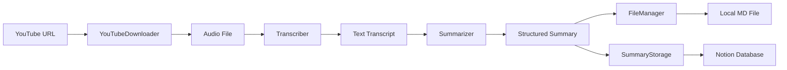
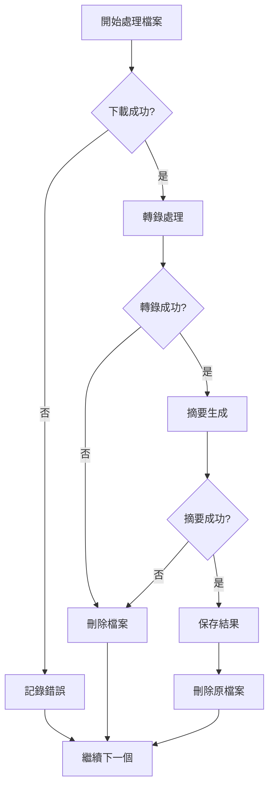

# System Patterns

## 架構概覽

系統採用 **管道-過濾器 (Pipeline-Filter)** 模式，將影片處理分解為獨立的處理階段：

## 設計模式

### 1. 策略模式 (Strategy Pattern)
- **Summarizer**: 支援多種 LLM 供應商 (OpenAI, Gemini, Ollama)
- **Transcriber**: 支援不同 Whisper 實現 (標準版, Faster-Whisper)
- **Storage**: 支援多種存儲後端 (本地檔案, Notion)

### 2. 門面模式 (Facade Pattern)
- **Main 類**: 隱藏複雜的工作流程，提供簡單的 `run()` 接口
- **各組件類**: 封裝底層複雜性，提供清晰的 API

### 3. 責任鏈模式 (Chain of Responsibility)
- **檔案處理**: 逐一處理 `data/videos/` 目錄下的檔案
- **錯誤處理**: 處理失敗時自動清理和跳過

### 4. 工廠模式 (Factory Pattern)
- **模型初始化**: 根據配置動態創建不同的 AI 模型實例

## 組件職責

### 核心處理組件
- **YouTubeDownloader**: 影片下載和元數據提取
- **Transcriber**: 語音轉文字處理
- **Summarizer**: AI 摘要生成
- **FileManager**: 檔案操作和清理
- **SummaryStorage**: 結果存儲和持久化

### 支援組件
- **Logger**: 統一日誌記錄
- **Prompt**: 提示詞模板管理
- **Main**: 工作流程編排

### 介面組件
- **streamlit_app.py**: Web 介面
- **main.py**: 命令列介面

## 錯誤處理策略

## 資料流模式

1. **批次處理**: 掃描目錄下所有檔案，逐一處理
2. **檔案生命週期**: 下載 → 處理 → 刪除（避免磁碟空間浪費）
3. **結果持久化**: 雙重存儲（本地 + 雲端）確保資料安全

## 擴展模式

- **水平擴展**: 支援多個 worker 並行處理
- **垂直擴展**: 模組化設計便於功能增強
- **集成擴展**: 標準化介面便於第三方整合