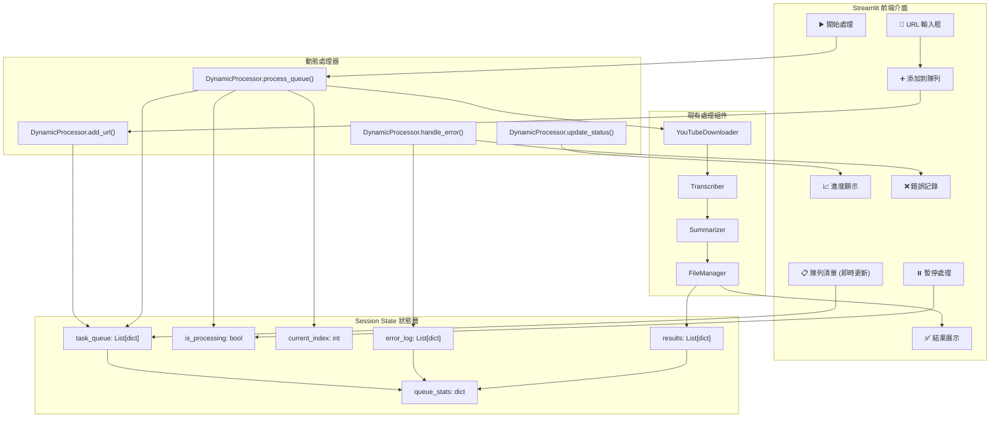

# Design - 批次處理優化

## 概述與目標

### 設計目標
1. **純 Streamlit 解決方案**: 完全基於 Session State，無需任何外部存儲
2. **動態隊列管理**: 支援隨時添加和即時處理
3. **用戶體驗優先**: 簡單直覺的單輸入框設計
4. **錯誤容忍**: 單點失敗不中斷整體流程
5. **輕量實現**: 最小化系統複雜度和資源使用

### 設計原則
- **狀態局域性**: 所有狀態存儲在 Session State，無需持久化
- **即時回應**: UI 狀態與處理進度即時同步
- **簡單優雅**: 避免過度設計，保持簡潔
- **向後相容**: 不影響現有單檔處理功能

## 系統架構

### 動態隊列系統架構


### 組件職責

#### 1. BatchProcessor (批次處理器)
```python
class BatchProcessor:
    """批次處理的核心協調器"""
    
    def add_urls(self, urls: List[str]) -> List[str]:
        """添加 URL 到處理隊列"""
        
    def start_processing(self) -> None:
        """開始批次處理"""
        
    def pause_processing(self) -> None:
        """暫停處理"""
        
    def resume_processing(self) -> None:
        """恢復處理"""
        
    def get_status(self) -> BatchStatus:
        """獲取整體處理狀態"""
```

#### 2. TaskQueue (任務隊列)
```python
class TaskQueue:
    """任務隊列管理器"""
    
    def enqueue(self, task: ProcessingTask) -> str:
        """任務入隊"""
        
    def dequeue(self) -> Optional[ProcessingTask]:
        """任務出隊"""
        
    def get_pending_tasks(self) -> List[ProcessingTask]:
        """獲取待處理任務"""
        
    def update_task_status(self, task_id: str, status: TaskStatus) -> None:
        """更新任務狀態"""
```

#### 3. TaskManager (任務管理器)
```python
class TaskManager:
    """任務生命週期管理"""
    
    def create_task(self, url: str) -> ProcessingTask:
        """創建處理任務"""
        
    def execute_task(self, task: ProcessingTask) -> TaskResult:
        """執行任務"""
        
    def handle_task_error(self, task: ProcessingTask, error: Exception) -> None:
        """處理任務錯誤"""
        
    def retry_task(self, task_id: str) -> None:
        """重試失敗任務"""
```

## 數據模型

### 核心數據結構

#### 任務項目結構
```python
# 單個任務的數據結構
task = {
    "id": str,              # 唯一識別碼 (timestamp_random)
    "url": str,             # YouTube URL
    "status": str,          # "waiting" | "processing" | "completed" | "failed"
    "title": str,           # 影片標題 (處理後獲得)
    "added_time": str,      # 添加時間 (ISO format)
    "start_time": str,      # 開始處理時間
    "end_time": str,        # 結束時間
    "error_msg": str,       # 錯誤訊息
    "result_path": str,     # 結果檔案路徑
    "retry_count": int      # 重試次數
}
```

#### Session State 完整結構
```python
# streamlit session_state 的完整結構
if "dynamic_queue" not in st.session_state:
    st.session_state.dynamic_queue = {
        # 輸入狀態
        "current_url_input": "",
        
        # 隊列管理
        "task_queue": [],              # List[dict] - 任務列表
        "current_index": 0,            # int - 當前處理的任務索引
        
        # 處理控制
        "is_processing": False,        # bool - 是否正在處理
        "should_stop": False,          # bool - 是否需要停止
        
        # 結果與錯誤
        "results": [],                 # List[dict] - 成功結果
        "error_log": [],               # List[dict] - 錯誤記錄
        
        # 統計資訊
        "stats": {
            "total": 0,
            "waiting": 0,
            "processing": 0,
            "completed": 0,
            "failed": 0
        }
    }
```

#### 狀態轉換規則
```python
# 任務狀態流轉
STATUS_TRANSITIONS = {
    "waiting" → "processing"      # 開始處理
    "processing" → "completed"    # 成功完成
    "processing" → "failed"       # 處理失敗
    "failed" → "waiting"          # 重試任務
}
```

### 狀態機描述 (取代資料庫需求)
本系統不使用任何持久化層，所有狀態均存在單一使用者 Session (Streamlit `session_state`).

#### 任務層狀態機
```text
waiting -> processing -> completed
                |-> failed -> (optional manual retry -> waiting)
```

#### 處理循環邏輯
```python
def processing_loop():
    dq = st.session_state.dynamic_queue
    if not dq["is_processing"]:
        return
    if dq["should_stop"]:
        dq["is_processing"] = False
        return
    # 邊界: 隊列為空或已越界
    if dq["current_index"] >= len(dq["task_queue"]):
        dq["is_processing"] = False
        return
    task = dq["task_queue"][dq["current_index"]]
    if task["status"] in ("completed", "failed"):
        dq["current_index"] += 1
        st.rerun()
    if task["status"] == "waiting":
        task["status"] = "processing"
        task["start_time"] = now_iso()
        try:
            result = process_pipeline(task["url"])  # 重用現有下載/轉錄/摘要流程
            task["status"] = "completed"
            task["end_time"] = now_iso()
            task["result_path"] = result["path"]
            dq["results"].append({"id": task["id"], **result})
        except Exception as e:
            task["status"] = "failed"
            task["end_time"] = now_iso()
            task["error_msg"] = str(e)
            dq["error_log"].append({
                "id": task["id"],
                "url": task["url"],
                "error": str(e),
                "time": now_iso()
            })
        finally:
            dq["current_index"] += 1
            update_stats()
            st.rerun()  # 驅動下一步
```

#### 設計取捨
1. 無持久化 => 瀏覽器刷新或會話過期資料會消失 (可後續新增可選「導出/導入 JSON」功能)
2. 單線程順序 => 避免並發錯誤與資源競爭問題 (I/O 密集流程足夠)
3. 使用 `st.rerun()` => 模擬輪詢 / 拉動式狀態推進
4. 可靠性轉為「易恢復」而非「永續保存」

## 技術決策與實現策略 (已針對無資料庫重寫)

### 1. 狀態管理選擇
**決策**: 使用 Streamlit Session State

**理由**:
- 無需额外依賴，純 Python 實現
- 自動與用戶會話綁定，天然隔離
- 即時响應，狀態變更立即生效
- 簡單明瞭，易於調試和維護

**替代方案**: SQLite (過於複雜), Redis (增加依賴)

### 2. URL 驗證策略
**決策**: 客戶端即時驗證 + 後端再次確認

**實現**:
```python
import re
from urllib.parse import urlparse

def validate_youtube_url(url: str) -> bool:
    """YouTube URL 驗證"""
    youtube_patterns = [
        r'(?:youtube\.com/watch\?v=|youtu\.be/)([a-zA-Z0-9_-]{11})',
        r'youtube\.com/embed/([a-zA-Z0-9_-]{11})',
        r'youtube\.com/v/([a-zA-Z0-9_-]{11})'
    ]
    return any(re.search(pattern, url) for pattern in youtube_patterns)
```

### 3. 非阻塞處理方案
**決策**: `st.rerun()` + 輕量狀態機 + 單步執行

**說明**:
- 每次使用者操作或 `processing_loop` 完成一個任務後觸發 rerun
- UI 重新渲染讀取最新狀態
- 無需 Thread / Async，避免同步問題

### 4. 錯誤處理機制
**決策**: 分層錯誤處理 + 自動跳過

**實現策略**:
```python
def process_single_task(task: dict) -> dict:
    """single task 處理函數"""
    try:
        # 下載 -> 轉錄 -> 摘要
        result = process_pipeline(task["url"])
        return {"status": "completed", "result": result}
    except DownloadError as e:
        return {"status": "failed", "error": f"下載失敗: {e}"}
    except TranscriptionError as e:
        return {"status": "failed", "error": f"轉錄失敗: {e}"}
    except Exception as e:
        return {"status": "failed", "error": f"未知錯誤: {e}"}
```

### 5. 用戶介面設計
**決策**: 分區塊布局 + 即時刷新 (無 websockets / 外部訊息通道)

**布局結構**:
```python
# Streamlit 布局結構
col1, col2 = st.columns([3, 1])
with col1:
    url_input = st.text_input("📝 YouTube URL")
with col2:
    add_button = st.button("➕ 添加")

st.divider()

# 隊列列表區域
queue_container = st.container()

# 控制按鈕區域
control_container = st.container()

# 進度和結果區域
result_container = st.container()
```

## 實現細節

### 核心函數設計

#### DynamicQueueManager
```python
class DynamicQueueManager:
    """Dynamic Queue Manager"""
    
    @staticmethod
    def add_url(url: str) -> bool:
        """URL 添加到隊列"""
        
    @staticmethod
    def start_processing() -> None:
        """start 處理隊列"""
        
    @staticmethod
    def process_next_task() -> bool:
        """process next task, return if should continue"""
        
    @staticmethod
    def update_statistics() -> None:
        """update session state statistics"""
        
    @staticmethod
    def get_queue_status() -> dict:
        """get current queue status"""
```

#### UI 更新機制
```python
def render_dynamic_queue_ui():
    """Render Dynamic Queue UI"""
    # 1. URL 輸入區域
    render_url_input_section()
    
    # 2. 隊列狀態區域
    render_queue_status_section()
    
    # 3. 控制按鈕區域
    render_control_buttons_section()
    
    # 4. 結果展示區域
    render_results_section()
    
    # 5. 錯誤記錄區域
    render_error_log_section()
```

### 性能與可用性優化
1. **懶惰顯示**: 使用 `st.expander` 包裹長摘要
2. **最少狀態寫入**: 僅在任務狀態變更時更新 `stats`
3. **資源釋放**: 任務完成後僅保留必要路徑，不長期保存巨大文字於記憶體
4. **簡化進度**: 使用已完成/總數比值顯示整體進度

### 可選擴展 (未納入本階段交付)
- 導出 / 匯入隊列快照 (JSON)
- 任務結果持久化至檔案索引 (單一 JSON 檔)
- 並行處理 (需重新評估資源鎖)
- Webhook / REST API (若未來需要外部觸發)

## API / 擴展說明
目前版本不提供任何 REST API 或事件匯流排。所有互動僅透過 Streamlit UI。若後續需要：
1. 先抽象出 `QueueService` 介面
2. 將目前 `session_state` 操作包成服務層
3. 再包裝 FastAPI / Flask 暴露端點

## 非功能性考量 (針對無資料庫簡化)

### 可靠性
1. **易理解**: 單流程、順序執行避免並發錯誤
2. **手動復原**: 若瀏覽器意外關閉，可重新貼上尚未處理的 URL
3. **錯誤隔離**: 任務失敗紀錄於 `error_log` 不阻塞後續

### 性能
1. 單任務串行 I/O (下載 / 轉錄 / 摘要) 對 CPU 壓力低
2. 可透過「限制任務數」避免 UI 過度渲染 (例如 > 200 條時折疊顯示)

### 可維護性
1. 嚴格分離 UI 與 Queue 操作函數
2. 抽象 `DynamicQueueManager` 以便未來替換儲存層

### 安全 / 輸入健全性
1. 僅允許白名單的 YouTube 網域格式
2. 限制每次添加 URL 長度 / 字元集
3. 過長摘要結果可截斷顯示

## 風險與緩解
| 風險 | 影響 | 緩解 |
|------|------|------|
| 瀏覽器刷新導致狀態遺失 | 任務需重新添加 | 後續加入「導出隊列JSON」功能 (非本階段) |
| 單任務執行時間過長 | 使用者以為卡住 | 在 UI 顯示「目前步驟」+ spinner |
| 重複 URL 填入 | 浪費資源 | `add_url` 時去重檢查 |
| 失敗任務無法追蹤 | 難以除錯 | `error_log` 詳細紀錄 (時間/錯誤訊息/URL) |
| 長摘要渲染卡頓 | UI 卡頓 | 使用 expander + lazy render |

## 測試策略 (調整為無資料庫場景)

### 單元測試
- URL 驗證 (`validate_youtube_url`)
- 任務建立與狀態轉換
- `processing_loop` 行為 (含成功/失敗分支)
- 統計數據更新

### 集成測試
- 動態添加 → 自動處理 → 錯誤隔離
- 失敗後重試流程
- 大量 URL (例如 50 條) 渲染效能

### 邊界測試
- 空隊列啟動處理
- 重複 URL 添加
- 偽造無效 URL
- 任務中途手動停止

---

**設計版本**: v1.1 (移除資料庫 / API / 並發內容，專注純 Session State)  
**最後更新**: 2025-08-19  
**設計師**: GitHub Copilot