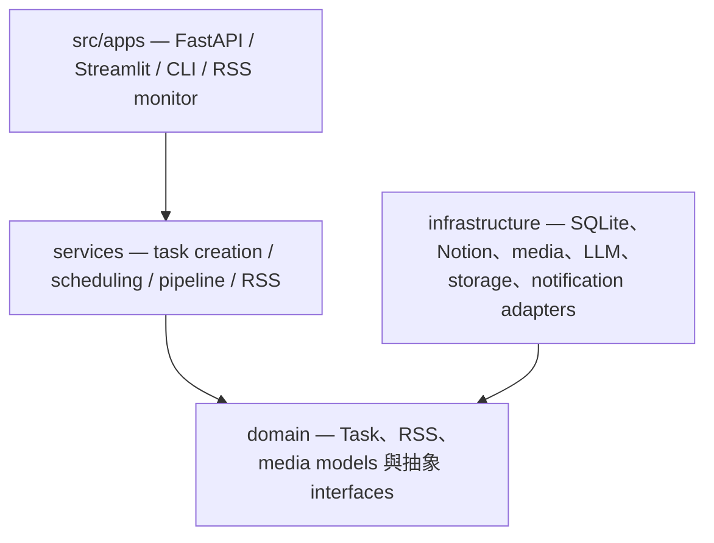

# 模組邊界與外部依賴

## Python 分層與依賴方向

Python 主系統以 `src` 為 package root；規範性的責任分層由入口向 use case 與 domain 收斂，第三方實作則留在 infrastructure：

`CONTRIBUTING.md` 將這套分層定義為現行開發規則：`domain` 保存 models 與 typed interfaces、`services` 負責 use-case orchestration、`infrastructure` 接觸 SQLite、Notion、yt-dlp、Whisper、LLM SDK 與 Discord，`src/apps` 承接 Python 的 HTTP、UI、CLI 與 RSS 入口。top-level `apps/` 目前則放置獨立的 Browser Extension 與 Nuxt Showcase。`core` 另提供環境設定、prompt、logging、時間與 URL/filename 工具。這是維護方向，不代表 framework 會自動阻止跨層 import；review 仍需檢查新依賴是否放在正確邊界。

這個方向不是完全由 framework 強制，但 `ProcessingWorker` 的 constructor factories 是最重要的邊界：downloader、transcriber、summarizer、summary storage、file manager、notifier 與 config 都可替換。測試因此能使用小型 fake，而不必真的下載影片、載入模型或呼叫外部 API。新增 adapter 時應實作既有小介面或 factory contract，避免把 provider-specific branch 放進 orchestration loop。

Nuxt Showcase 與 Browser Extension 不屬於這個 Python package graph。Showcase 位於 `apps/showcase/`，是獨立 npm application，透過 Nitro server 直接讀 Notion；Extension 位於 `apps/browser-extension/`，使用瀏覽器 API 呼叫 FastAPI。它們與 Python 的整合契約分別是 Notion schema 與 HTTP API，而不是 source-level imports。

## Python runtime dependencies

`pyproject.toml` 宣告 Python 3.14 與固定版本 runtime dependencies，可依責任分組：

| 類別 | 套件 | 系統用途 |
| --- | --- | --- |
| HTTP/UI | `fastapi`、`uvicorn`、`streamlit`、`requests` | Task API、互動 UI、RSS/API client 與 Discord webhook |
| Media | `faster-whisper`、`whisper`、`pytubefix` | 主流程轉錄、legacy Whisper method，以及目前 manifest 中的下載相關套件 |
| LLM | `google-generativeai`、`openai`、`ollama` | Gemini、OpenAI 與 Ollama provider adapters |
| Persistence | `notion-client` | Notion task backend 與 summary page 寫入 |
| Configuration | `python-dotenv` | 從 `.env` 載入 runtime configuration |

實際主轉錄路徑建立 `faster_whisper.WhisperModel`；同一 adapter 仍保留呼叫 `whisper.load_model` 的 legacy method，但一般 `transcribe()` 不走該路徑。`pytubefix` 雖列在 manifest，`src` 目前沒有 import；下載實作改由 subprocess 執行 `yt-dlp`。這些都是依賴清理時應重新驗證的現況，不代表文件已判定套件可以移除。

另外有兩個直接 import 依賴沒有列在 project dependency list：FastAPI models 直接 import `pydantic`，`Config` 直接 import `pytz`。兩者目前都由其他套件間接鎖入 `uv.lock`，但依賴解析成功不等同 direct dependency contract；若要清理 manifest，應先新增或調整 focused tests，再更新 `pyproject.toml` 與 lockfile。

## 外部 executable 與系統能力

媒體下載依賴 PATH 上可執行的 `yt-dlp`，不是 Python dependency。`make install` 與 `make yt-dlp-update` 會從 GitHub release 下載 binary 到 `/usr/local/bin/yt-dlp`；Docker API 啟動時也預設先更新它。這表示 `uv sync` 成功仍不足以保證下載功能可用，且本機安裝可能需要寫入系統目錄的權限。

SQLite 使用 Python 標準函式庫 `sqlite3`，檔案與 JSON 輸出使用標準函式庫，不需要獨立 database server。Whisper 模型則在 runtime 由 faster-whisper 載入，屬於可能產生下載、CPU、記憶體與磁碟成本的重型依賴。

Betterleaks 是另一個 PATH 上的本機開發工具，不屬於 Python、Nuxt 或應用 runtime dependency。Repository hook 透過 `betterleaks git --staged` 檢查 Git index，並由 `make install-hooks` 設定 local `core.hooksPath`；目前 Python CI workflow 沒有執行這個 gate，因此 clone 後仍需在每個 checkout 安裝 hook。

## 遠端服務與 trust boundaries

- YouTube 提供影片、yt-dlp metadata 與 channel Atom feeds；metadata 會先縮減成 domain 白名單，不能直接控制 prompt 規則。
- Gemini、OpenAI 或 Ollama 接收 title、transcript 與受限 metadata context；credential 只決定 provider 是否 eligible。
- Notion 同時可作 task backend、summary publication target 與 Showcase read model，但三種用途的 consistency 與 schema assumptions 不相同。
- Discord webhook 只接收完成通知；沒有設定時跳過，HTTP delivery failure 由 notifier 轉成 `False`。
- Browser Extension 將使用者設定的 API base URL 保存在 `chrome.storage.sync`，Nuxt 則把 Notion secret 留在 server-only runtime config。

## Nuxt 與開發依賴

`apps/showcase/package.json` 是獨立 dependency boundary。Production dependencies 只有 Nuxt 與 `markdown-it`；Vue 由 Nuxt ecosystem 提供。TypeScript、Vitest、jsdom、Vue Test Utils 與 Vite Vue plugin 屬於 development/test dependencies。Python 開發依賴則是 flake8 與供 FastAPI TestClient 使用的 httpx。

因此變更依賴時要更新正確的 lock boundary：Python 使用 `pyproject.toml` 與 `uv.lock`，Showcase 使用 `package.json` 與 `package-lock.json`，yt-dlp 則由 Make/Docker 安裝流程管理。不要以其中一個 lockfile 推論另一個 runtime 已可用。

## 延伸閱讀

- [系統架構與端到端資料流](system-overview.md)
- [LLM Providers、選擇與 Failover](../integrations/llm-providers.md)
- [任務、鎖與結果持久化](task-and-result-storage.md)
- [開發規則與測試策略](../operations/development-and-testing.md)
