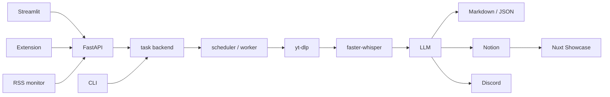

# 系統架構與端到端資料流

本 repository 由 Python processing platform、Browser Extension 與獨立 Nuxt Showcase 組成。Python 主系統負責接受 YouTube 任務、執行媒體下載與 AI 摘要、保存任務及結果；Extension 是 FastAPI client；Showcase 則直接從 Notion 讀取已完成成果。Python 與 Showcase 以 Notion schema 作為整合邊界，不會互相呼叫 HTTP API。

## 執行入口與責任

| 入口 | 責任 | 執行方式 |
| --- | --- | --- |
| FastAPI `src.apps.api.main:app` | 建立與重試任務、管理 RSS 訂閱、排程 worker、檢視或釋放全域 processing lock | `make api`，預設 port 8080 |
| Streamlit `src/apps/ui/streamlit_app.py` | 互動式建立、瀏覽與操作任務；把畫面和 session state 分派給 `ui_*` 模組 | `make streamlit`，預設 port 8501 |
| CLI `src.apps.workers.cli` | 選擇 SQLite 或 Notion backend，同步執行一次 queue drain，輸出處理統計 | `make run` 或 module invocation |
| RSS monitor `src.apps.workers.rss_monitor` | 輪詢已啟用的 YouTube channel feed，透過 API 建立新任務 | `make rss-monitor` |
| Browser Extension | 從 YouTube 影片、連結或 channel context 呼叫 task/RSS API；在瀏覽器顯示 badge 與通知 | 載入 `apps/browser-extension` 的 unpacked Manifest V3 extension |
| Nuxt Showcase | 以 server routes 查詢 Notion，提供成果列表與詳細頁 | `npm run dev`，預設 port 3000 |

Docker Compose 只編排 Python 側的 `api`、`streamlit` 與 `rss-monitor`。三者共用 repository volume 與 `.env`；Streamlit 和 RSS monitor 以 `http://api:8080` 連向 API。Nuxt showcase 不在此 Compose topology 中，通常獨立開發或部署。

## 主資料流

1. 使用者從 Streamlit、Browser Extension、HTTP client 或 RSS monitor 送出 YouTube URL。CLI 則可直接 drain 已存在的 queue。
2. FastAPI 正規化 URL，透過 `DBFactory` 選擇 SQLite 或 Notion adapter，執行去重並建立待處理任務。
3. 新任務建立後，API 嘗試排程背景 worker。排程失敗不會撤銷已入列任務，response 會明確指出任務已排隊但 worker 未啟動。
4. `ProcessingWorker` 先取得 backend 的全域 processing lock，再逐一取得 task lock。它在同一 worker 內依序完成下載、轉錄、摘要、Markdown 保存、Notion 保存與 Discord 通知。
5. 每一筆任務的例外會轉成 `Failed` 狀態並累計失敗數；worker 繼續處理下一筆。queue 完成或取得任務失敗後，都會在 `finally` 釋放全域 lock。
6. 完成結果寫入 Notion 後，Nuxt server API 以自己的設定、schema mapping 與 SWR cache 讀取 `Completed` 結果；瀏覽器只呼叫 Nuxt internal API，不會取得 Notion API key。

## 邊界與依賴方向

`src/domain/interfaces` 定義抽象，application services 組合 use cases，`src/infrastructure` 提供第三方 adapters，`src/apps` 暴露各種入口。完整分層、factory seams 與 dependency inventory 由[模組邊界與外部依賴](module-boundaries-and-dependencies.md)集中說明。

Streamlit 是 FastAPI 的 client，而不是另一個 pipeline owner。CLI 則直接建立 backend 並呼叫同步的 `process_pending_tasks`。因此所有入口最終共享同一組 task persistence 與 processing-lock 語意，但觸發方式分為 HTTP background scheduling 與 command-line synchronous drain。

Extension 與 RSS monitor 都只負責建立輸入，不直接執行 media pipeline；Nuxt Showcase 只消費 Notion 成果，不依賴 Task API。各自的 endpoint、credential 與 failure contract 由相關 integration/API 頁負責。

## 重要邊界

- FastAPI 是 task submission 與 worker scheduling 邊界；完整 status 及 authentication 語意見[HTTP API 與 Client 契約](../integrations/http-api-and-clients.md)。
- Task backend、locks、Notion publication 與本機 artifacts 的保證不同，見[任務、鎖與結果持久化](task-and-result-storage.md)。
- Browser Extension、RSS、LLM、Notion 與 Showcase 各自持有不同的 network、credential 及 trust boundary，細節留在對應 integration 頁。

## 延伸閱讀

- [任務生命週期與併發控制](../workflows/task-lifecycle.md)
- [媒體轉錄與摘要流程](../workflows/media-processing.md)
- [HTTP API 與 Client 契約](../integrations/http-api-and-clients.md)
- [任務、鎖與結果持久化](task-and-result-storage.md)
- [Notion 資料整合](../integrations/notion-and-showcase.md)
