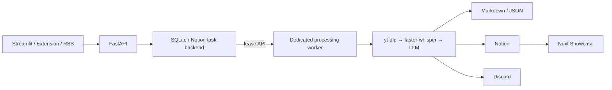

# 系統架構與端到端資料流

本 repository 的三個應用位於頂層 `apps/`：`apps/whisper_summary/` 是 Python modular monolith，另有 Browser Extension 與 Nuxt Showcase。Python package 的 import 名稱仍是 `whisper_summary`，提供 FastAPI、Streamlit、同步 CLI、dedicated processing worker 與 RSS monitor；Extension 呼叫 FastAPI，Showcase 則由 Nitro server routes 直接讀取 Notion。

## Runtime

| 入口 | 責任 |
| --- | --- |
| `whisper_summary.apps.api.main:app` | 建立／重試 task、RSS 訂閱及 processing lock 維運 API |
| `apps/whisper_summary/apps/ui/streamlit_app.py` | 操作者 UI，透過 HTTP API 建立任務並檢視狀態 |
| `whisper_summary.apps.workers.processing_worker` | 持續輪詢 persisted queue，執行重型 pipeline |
| `whisper_summary.apps.workers.cli` | 同步 drain 一次 queue |
| `whisper_summary.apps.workers.rss_monitor` | 輪詢 YouTube feeds，透過 Task API 建立任務 |
| `apps/browser-extension` | Manifest V3 FastAPI client |
| `apps/showcase` | 直接讀取 Notion 完成成果的 Nuxt/Nitro app |

Compose 編排 `api`、`streamlit`、`processing-worker` 與 `rss-monitor`。Streamlit、RSS monitor 與 processing worker 都以 `http://api:8080` 連線；task 的 SQLite ownership 集中於 API。Showcase 不在此 Compose topology。

## 端到端流程

1. Streamlit、Extension、HTTP client 或 RSS monitor 向 FastAPI 送出 YouTube URL。
2. API 正規化、去重並把 task 持久化；API process 不啟動重型 pipeline。
3. Dedicated worker 持續透過受 token 保護的 HTTP queue API claim task；單次 polling cycle 失敗會記錄後繼續下一輪。
4. API 以 SQLite lease 控制 task ownership，worker 持續 heartbeat，並以設定或 task override 選擇 legacy／LangGraph engine。處理包含 yt-dlp、faster-whisper、LLM、Markdown/JSON、Notion 與 Discord；單筆失敗標記 Failed，失去 lease 時停止更新該 task。
5. Nuxt Showcase 從 Notion 讀取 Completed 結果，不呼叫 Python Task API，也不把 Notion credential送到瀏覽器。

```mermaid
flowchart LR
  UI[Streamlit / Extension / RSS] --> API[FastAPI]
  API --> Queue[SQLite / Notion task backend]
  Queue -->|lease API| Worker[Dedicated processing worker]
  Worker --> Media[yt-dlp → faster-whisper → LLM]
  Media --> Files[Markdown / JSON]
  Media --> Notion
  Media --> Discord
  Notion --> Showcase[Nuxt Showcase]
```

Domain contracts、services 與 adapters 的方向見[模組邊界與外部依賴](module-boundaries-and-dependencies.md)；queue 與 lock 行為見[任務生命週期](../workflows/task-lifecycle.md)。
