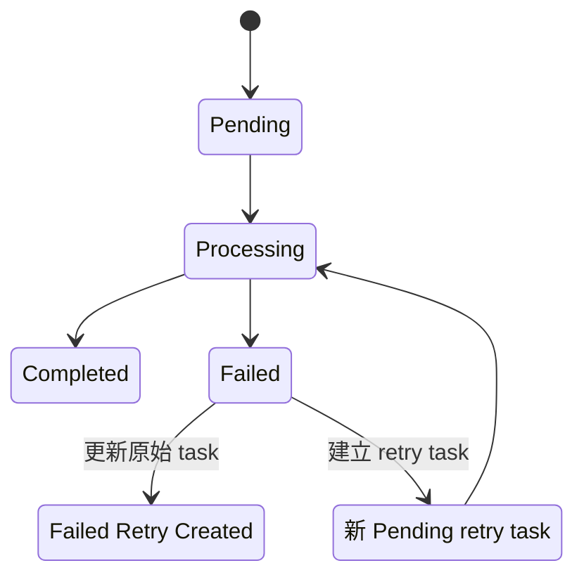

# 任務生命週期與併發控制

<!-- openwiki: broken internal link [../interfaces/http-api-and-clients.md] file "../interfaces/http-api-and-clients.md" does not exist. Fix the href or restore the target, then delete this comment. -->
<!-- openwiki: broken internal link [../persistence/task-and-result-storage.md] file "../persistence/task-and-result-storage.md" does not exist. Fix the href or restore the target, then delete this comment. -->
本頁聚焦 task 的狀態與控制流；完整 HTTP status/auth contract 見[HTTP API 與 Client 契約](../interfaces/http-api-and-clients.md)，backend schema 與一致性比較見[任務、鎖與結果持久化](../persistence/task-and-result-storage.md)。

## 建立與去重

建立流程先正規化 YouTube URL，再由 `create_task_record` 查找相同 URL 最新且非失敗的 task：

- `Pending` / `Processing`：視為 active duplicate；
- `Completed` + `block_existing`：永久阻擋，RSS 使用此 policy。
- `Completed` + `cache_ttl`：建立時間仍在 TTL 內時重用既有結果；
- 沒有上述情況：建立新的 `Pending` task。

只有新 task 會寫入 queue；API 不啟動重型處理，cached 或 duplicate 也不建立新 task。HTTP status 與 response 欄位由[HTTP API 與 Client 契約](../integrations/http-api-and-clients.md)統一說明。

## Dedicated worker 與兩層 ownership

常駐 `processing-worker` 依 polling interval反覆呼叫 queue drain，API process不建立 daemon thread。每次 drain由 `ProcessingWorker` 取得全域 processing ownership，處理期間 refresh，並在所有退出路徑釋放；若其他 worker持有有效 lock，本輪不處理，下一輪再嘗試。

每筆 task 另有獨立 ownership：worker 以 atomic transaction取得最舊 Pending task，stale Processing task 可在 timeout 後回收。這兩層控制分別避免多個 queue drain 同時處理，以及同一 task 被重複處理。實作細節見[任務與結果儲存](../architecture/task-and-result-storage.md)。

## 狀態轉移

成功時保存 title、summary、duration 與 Notion page id；失敗時保存 error 與 duration。Worker 將單筆 exception 收斂為 `Failed` 後繼續下一筆，queue 空時停止並在 `finally` 釋放全域 ownership。

Retry 只接受現況為 `Failed` 的 source task。它建立有 relationship 的新 Pending task，再把 source 改成 `Failed Retry Created`。Retry task同樣留在 persisted queue，等待 dedicated worker下一輪取得。

## 延伸閱讀

- [系統架構與端到端資料流](../architecture/system-overview.md)
- [HTTP API 與 Client 契約](../integrations/http-api-and-clients.md)
- [任務與結果儲存](../architecture/task-and-result-storage.md)
- [媒體轉錄與摘要流程](media-processing.md)
- [YouTube RSS 自動化](rss-automation.md)
