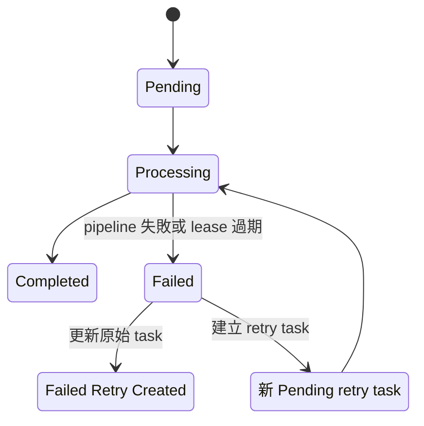

# 任務生命週期與併發控制

本頁聚焦 task 的狀態與控制流；完整 HTTP status/auth contract 見[HTTP API 與 Client 契約](../interfaces/http-api-and-clients.md)，backend schema 與一致性比較見[任務、鎖與結果持久化](../persistence/task-and-result-storage.md)。

## 建立與去重

建立流程先正規化 YouTube URL，再由 `create_task_record` 查找相同 URL 最新且非失敗的 task：

- `Pending` / `Processing`：視為 active duplicate；
- `Completed` + `block_existing`：永久阻擋，RSS 使用此 policy。
- `Completed` + `cache_ttl`：建立時間仍在 TTL 內時重用既有結果；
- 沒有上述情況：建立新的 `Pending` task。

只有新 task 會寫入 queue；API 不啟動重型處理，cached 或 duplicate 也不建立新 task。HTTP status 與 response 欄位由[HTTP API 與 Client 契約](../interfaces/http-api-and-clients.md)統一說明。

## Dedicated worker 與 task lease

常駐 `processing-worker` 依 polling interval 反覆呼叫 queue drain，API process 不建立 daemon thread。Worker 透過 `HttpTaskQueue` 呼叫中央 API；API 持有 SQLite queue，所有 worker 的 claim 都在同一 database 內協調。

SQLite 在 `BEGIN IMMEDIATE` 內先把過期或不完整 lease 的 Processing task 標記 Failed，需人工重試；再原子取得最舊 Pending task，核發 worker id、lease token 與 locked time。Worker 處理期間持續 heartbeat，progress、complete、fail 都要匹配 token。開始 pipeline 時依 task override、`PROCESSING_ENGINE` 設定、`legacy` fallback 的順序選擇 legacy 或 LangGraph；此選擇不改變 queue 狀態轉移或 lease 規則。失去 lease 時，原 worker 不再更新該 task。全域 processing lock 的資料與管理 API 仍存在，但常駐 worker 不使用它作為 queue ownership。實作細節見[任務與結果儲存](../persistence/task-and-result-storage.md)。

## 狀態轉移

```mermaid
stateDiagram-v2
    [*] --> Pending
    Pending --> Processing
    Processing --> Completed
    Processing --> Failed: pipeline 失敗或 lease 過期
    Failed --> FailedRetryCreated: 更新原始 task
    Failed --> PendingRetryTask: 建立 retry task
    state "Failed Retry Created" as FailedRetryCreated
    state "新 Pending retry task" as PendingRetryTask
    PendingRetryTask --> Processing
```

成功時保存 title、summary、duration 與 Notion page id；失敗時保存 error 與 duration。Worker 將單筆 exception 收斂為 `Failed` 後繼續下一筆；失去 lease 時不回寫，queue 空時停止本輪 drain。

Retry 只接受現況為 `Failed` 的 source task。它建立有 relationship 的新 Pending task，再把 source 改成 `Failed Retry Created`。Retry task同樣留在 persisted queue，等待 dedicated worker下一輪取得。

## 延伸閱讀

- [系統架構與端到端資料流](../architecture/system-overview.md)
- [HTTP API 與 Client 契約](../interfaces/http-api-and-clients.md)
- [任務與結果儲存](../persistence/task-and-result-storage.md)
- [媒體轉錄與摘要流程](media-processing.md)
- [YouTube RSS 自動化](rss-automation.md)
